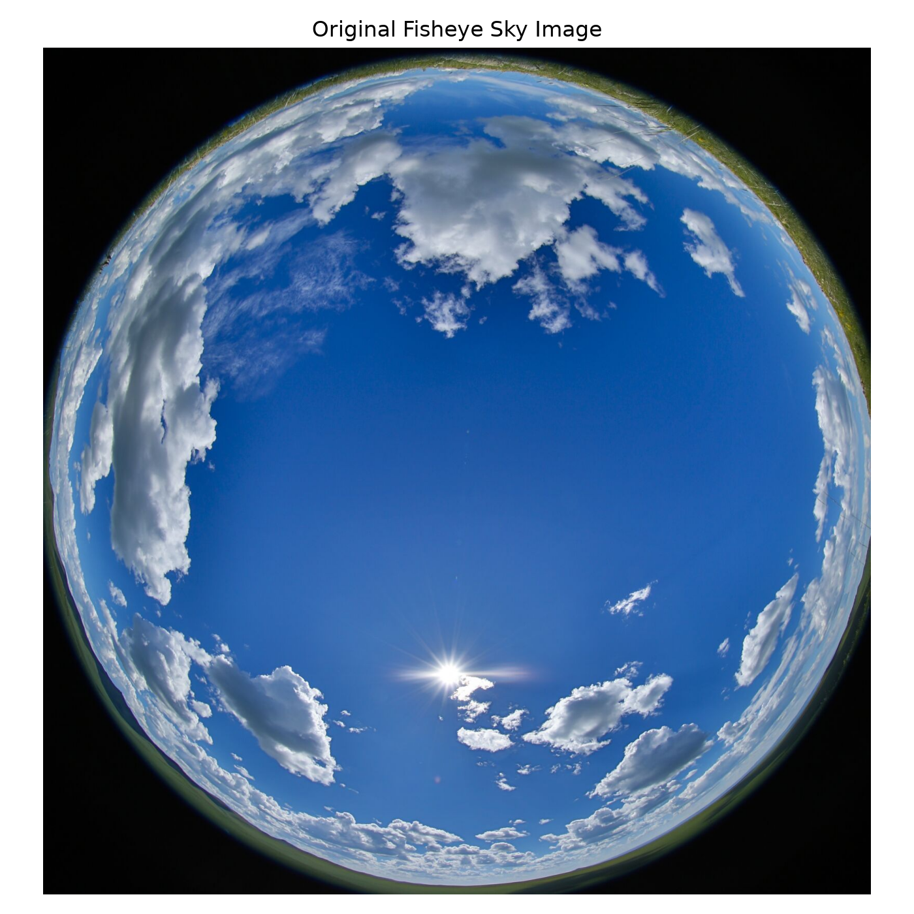
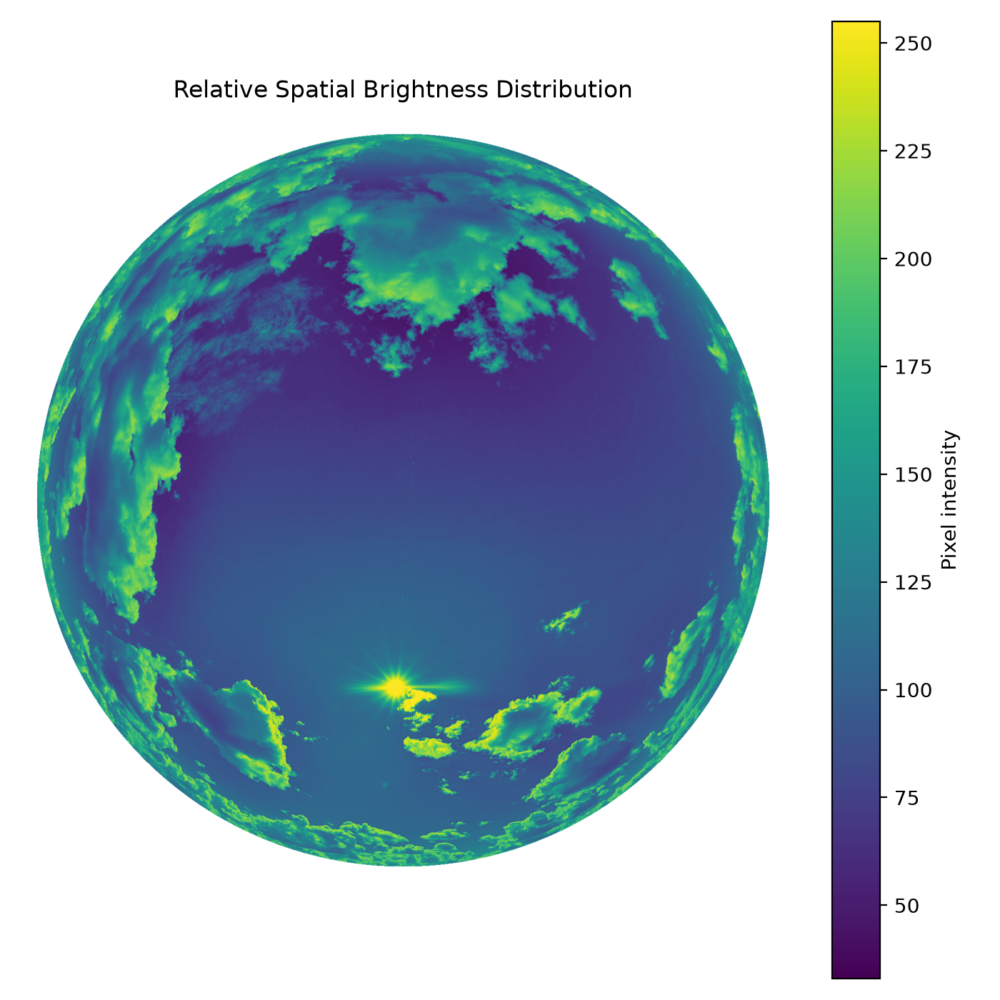
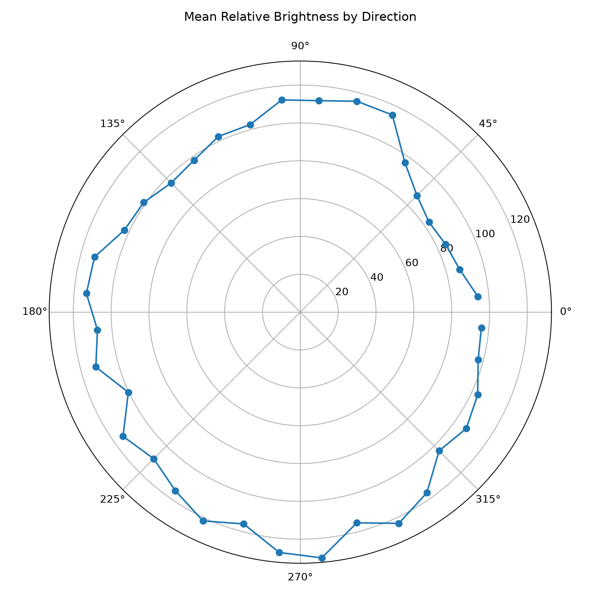
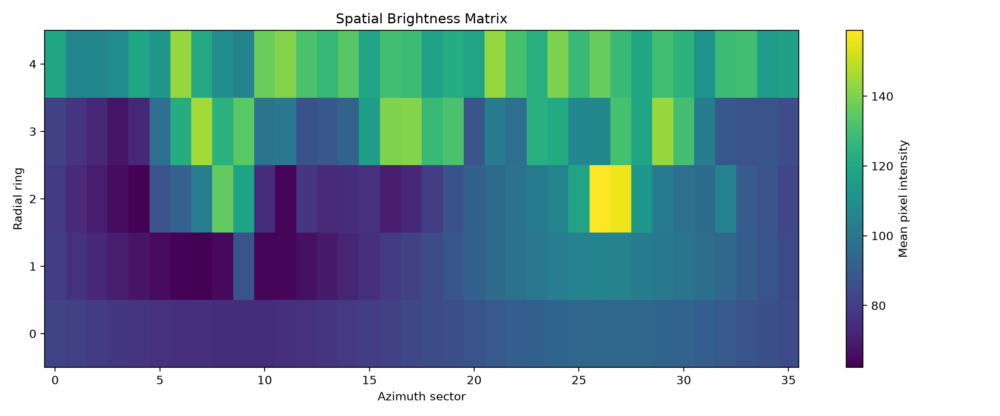

# Fisheye Sky Brightness Analysis PoC

## Overview

This proof-of-concept explores the spatial distribution of relative brightness in hemispherical fisheye sky images.

It was developed as a preliminary technical exercise for fisheye-based daylight analysis and Environmental Light Field (ELF) related research.

The workflow transforms image coordinates into a polar representation, divides the hemispherical image into angular sectors and radial regions, and calculates relative brightness statistics for each spatial region.

## Objectives

The PoC demonstrates a simple workflow for:

- reading and preprocessing fisheye sky images,
- identifying the circular hemispherical image region,
- converting Cartesian image coordinates into polar coordinates,
- dividing the image into azimuth sectors,
- dividing the image into radial rings,
- computing regional mean brightness values,
- visualizing spatial and directional brightness distributions.

## Method

A grayscale representation of the original image is used as a simplified proxy for relative brightness.

For each pixel, its position relative to the image center is described using:

- radial distance,
- angular direction.

The current implementation divides the hemispherical image into:

- 36 angular sectors,
- 5 radial rings.

Mean pixel intensity is calculated for each spatial region.

The resulting information is visualized as:

1. the original fisheye image,
2. a masked spatial brightness distribution,
3. a polar plot showing mean brightness by direction,
4. a two-dimensional spatial brightness matrix.

## Example Results

### Original Fisheye Image



### Relative Spatial Brightness Distribution



### Directional Brightness Distribution



### Spatial Brightness Matrix



## Important Limitation

Pixel intensity in this PoC must not be interpreted as calibrated luminance.

True photometric luminance estimation requires additional information such as:

- camera calibration,
- exposure settings,
- sensor response characteristics,
- fisheye projection characteristics,
- photometric calibration.

The current implementation therefore represents only relative spatial brightness.

It is intended as a methodological prototype and preparation for more rigorous fisheye-based daylight and ELF analysis rather than as a complete or photometrically calibrated ELF implementation.

## Project Structure

```text
fisheye-sky-brightness-poc/
│
├── data/
│   └── fisheye_sky.jpg
│
├── output/
│   ├── 01_original_image.png
│   ├── 02_brightness_distribution.png
│   ├── 03_polar_brightness.png
│   └── 04_spatial_matrix.png
│
├── main.py
├── requirements.txt
└── README.md
```

## Installation

Create a Python environment and install the required packages:

```bash
pip install -r requirements.txt
```

## Usage

Place a hemispherical fisheye sky image in:

```text
data/fisheye_sky.jpg
```

Then run:

```bash
python main.py
```

The generated figures will be stored in the `output` directory.

## Current Processing Workflow

The current processing pipeline consists of the following steps:

```text
Fisheye Sky Image
        ↓
Grayscale Conversion
        ↓
Circular Fisheye Mask
        ↓
Polar Coordinate Mapping
        ↓
Angular Sector Segmentation
        ↓
Radial Ring Segmentation
        ↓
Regional Brightness Statistics
        ↓
Spatial and Directional Visualization
```

## Possible Extensions

Future extensions could include:

- automatic detection of the fisheye image boundary,
- conversion from image radius to zenith angle using the camera projection model,
- explicit physical azimuth and zenith-angle mapping,
- camera-response and exposure correction,
- calibrated luminance estimation,
- RGB or spectral analysis,
- analysis of multiple fisheye images as a time series,
- comparison of spatial light distributions during sunrise,
- integration of meteorological data such as cloud cover and humidity,
- integration of atmospheric parameters such as aerosols,
- validation against an existing Environmental Light Field implementation.

## Motivation

This project serves as a small technical preparation for research involving Environmental Light Field analysis, fisheye imaging, daylight measurements, and spatiotemporal environmental data analysis.

The main purpose is to become familiar with spatial processing of hemispherical images before working with calibrated photometric data and established ELF implementations.